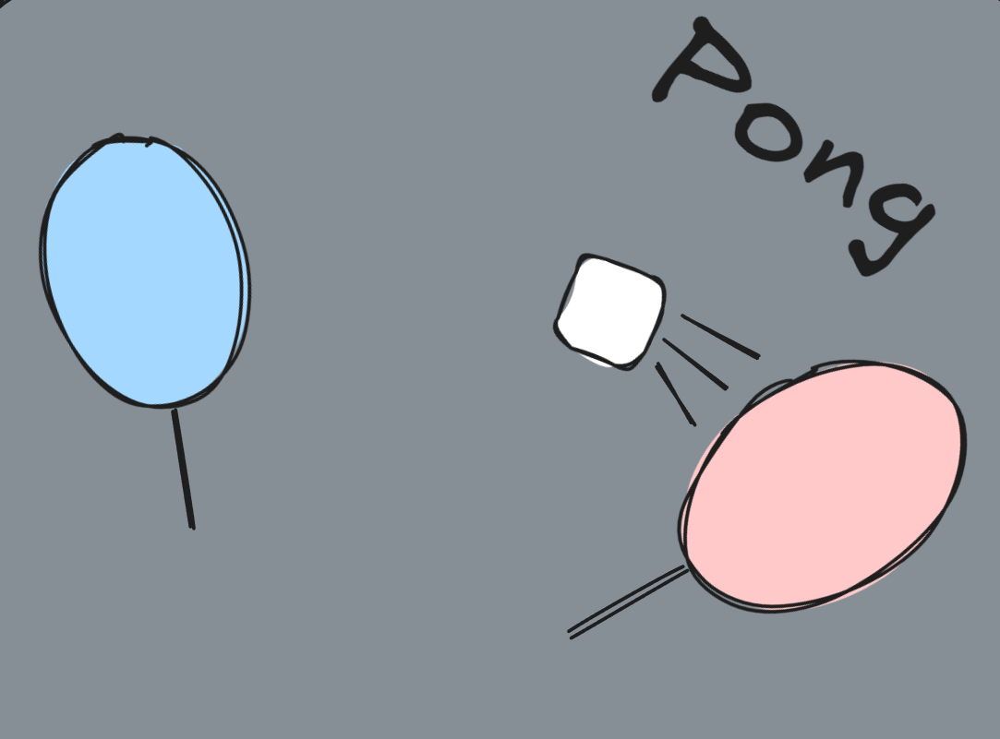
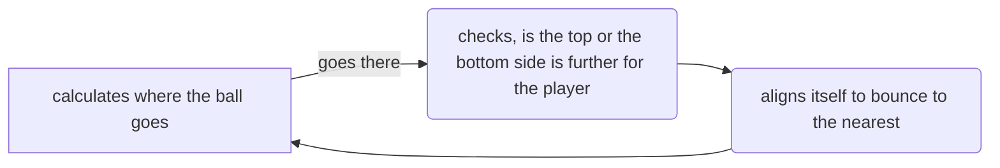

# Pong

This is **classical pong** made with HTML, CSS and JS. I made the screen 32x32 pixels(they're actually divs). I implemented PvP mode and PvB too(PvP online maybe will come out later).＼(ﾟｰﾟ＼)

# Features 

 1. Player versus player mode
 2. Player versus bot mode(be aware⚠️, it's impossible to beat the bot😈) 

# Usage
PvP: player on the left uses W and S key, Player on the right uses up arrow and down arrow.
PvB:Same on the left side

If you want to change game mode, just click on the buttons
If you want to wipe the score, just reload the page🤠 

### How the bot actually works

